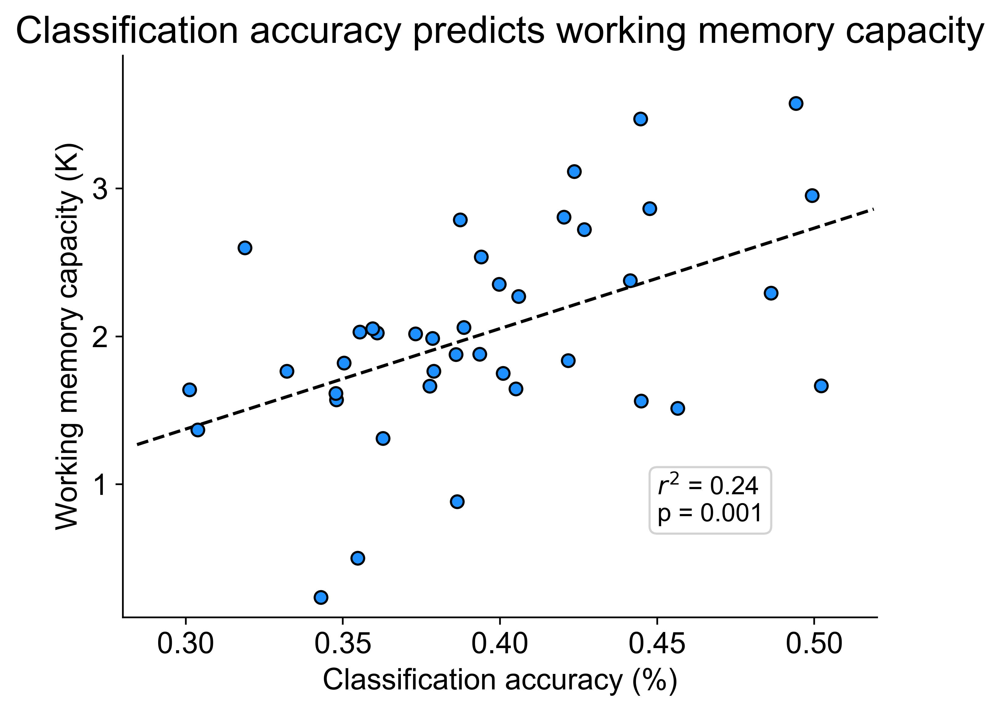
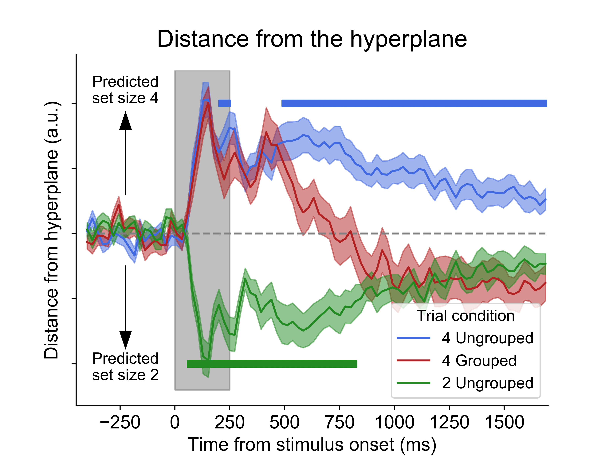
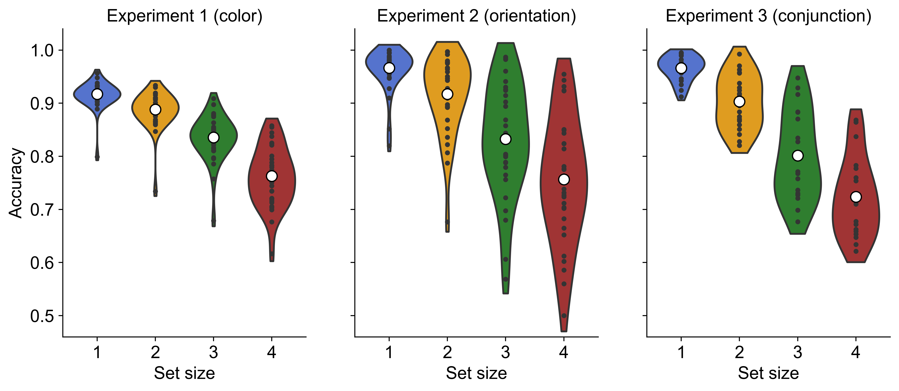

# Thyer-et-al-2021

## Overview and setup 

Analysis code for Thyer et al 2021 (in prep). Working title: "Multivariate decoding of visual working memory load  provides evidence for item-based pointers". This is the code used to generate analysis and figures. Data will be made available on OSF. Put data in folder titled `data` in top directory. 

This decoding uses the [Mord](https://github.com/fabianp/mord) package which is a ordinal logistic regression package. Download the package and put it in a folder called `mord` in the top directory. Alternatively, just use the `sklearn.linear_model.LogisticRegression` for slightly worse decoding accuracies.

## Files

`decode_eeg.py`

- Contains vast majority of functionality for loading and wrangling data, cross-validation, classification, plotting, and stats testing. All notebooks import this package.
  
- `Experiment`
  - Handles loading data. Directories, data info, subjects, etc.
- `Experiment_Syncer`
  - Handles synchronizing subjects across multiple experiments using unique IDs. Also uses `Experiment` functions.
- `Wrangler`
  - Handles data augmentation before classification. That includes trial binning, selecting classes, cross-validation, and rolling over time.
- `Classification`
  - Handles actual classification. Basically standardizing data, training, and testing models.
- `Interpreter`
  - Takes in results from classification. Handles all of the plotting and statistical testing of results.
- `ERP`
  - Less connected than the other classes. Handles plotting of ERPs.

`decode_eeg.ipynb`

- Basic notebook for load classification within an experiment. Not actually used, since `decode_eeg_loop.ipynb` handles all within-experiment decoding. Still a useful template.

`decode_eeg_loop.ipynb`

- Loops through experiments and trial bin size parameter and performs classifications.

`decode_load_single_feature.ipynb`

- Trains classifiers on experiment 1 (color) and tests on experiment 2 (orientation) and vice versa.

`decode_load_single_feature_set_size.ipyng`

- Train classifiers on mixture of experiment 1 (color) and tests on experiment 2 (orientation) with set size 1 vs 2, 2 vs 3, & 3 vs 4.

`decode_load_single_feature_to_conjunction.ipynb`

- Trains classifiers on experiment 1 and 2 (single feature, color or orientation) and tests on experiment 3 (conjunction, color & orientation).

`decode_preds_dont_double.ipynb`

- Trains classifiers on experiment 1 and 2 (single feature, color or orientation) 1 vs 2 and 2 vs 4. Also trains classifiers on experiment 3 (conjunction, color & orientation) 1 vs 2 and 2 vs 4. Then compares predictions from those classifiers.

`decode_load_acc_and_k.ipynb`

- Classifies load on all unique subjects across all three experiments. Also calculates K for each subject. Then correlates classification accuracy and K.

`decode_load_colinearity_hyperplane.ipynb`

- Using data from Diaz et al. 2021, train classifier on set size 2 ungrouped and set size 4 ungrouped. Then test on set size 4 grouped (4 items, but arranged to look like 2). Measure distance from hyperplane for each condition.

`behavior_analysis.ipynb`

- Plots behavior. Specifically accuracy across set sizes.

`plot_erp.ipynb`

- Plots frontal, central, and parietal/occipital ERPs for each experiment.

`decode_load_eyetracking.ipynb`

- Classifies load in Experiment 1 using EOG data. Plots accuracy, setsize pair accuracy, and confusion matrices.

